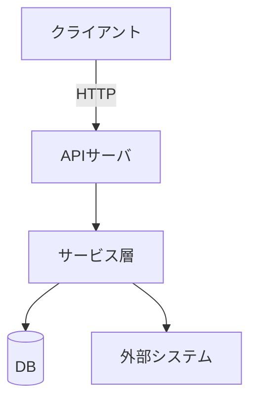

# CLAUDE.md  - Pythonバックエンド（業務システム）用テンプレート

## プロジェクト概要

> 2〜3 行でシステムの目的を記載。略語は初出時に定義する。

（ここに記入）

## 機能一覧

> 動詞始まりの箇条書き。機能 ID は要件定義書（docs/requirements/）の FR-xxx と揃える。

- （機能1: FR-001）
- （機能2: FR-002）

## アーキテクチャ

> Mermaid flowchart で主要コンポーネントとデータの流れを示す。15 要素以内に収める。



## 技術スタック

> 「要選択」の行を埋めてから使用する。「固定」はプロジェクト標準として変更しない。

| 区分 | 採用技術 | 種別 |
|---|---|---|
| 言語 | Python X.XX | 要選択 |
| Web フレームワーク | （例: FastAPI） | 要選択 |
| バリデーション | （例: Pydantic） | 要選択 |
| 非同期 HTTP | （例: aiohttp） | 要選択 |
| DB / ストレージ | （例: PostgreSQL + SQLAlchemy） | 要選択 |
| ログ | structlog | 固定 |
| テスト | pytest / pytest-asyncio | 固定 |
| Lint / 型検査 | ruff / mypy --strict | 固定 |
| 依存管理 | uv | 固定 |
| コンテナ | Docker | 固定 |

## 外部 I/F 仕様

> 詳細は docs/spec.md に分離し、ここではポインタと主要エンドポイントのみ記載。

| メソッド | パス | 概要 |
|---|---|---|
| POST | `/api/v1/resources` | リソース登録 |
| GET  | `/api/v1/resources/{id}` | リソース取得 |

## システムスケール要件

> 数値で定量的に記載。「高速」「多い」などの曖昧な表現は禁止。該当しない行は削除する。

| 指標 | 目標値 |
|---|---|
| レスポンスタイム | p95 ≤ X 秒 |
| 同時接続数 | ≤ X セッション |
| 可用性 | X % 以上 |
| データ量（DB） | X GB 以下 |
| バッチ処理時間 | X 分以内 |

## Claudeの振る舞い

### 判断の方針

- **曖昧さ**: 設計判断に関わる曖昧さは確認質問を返す。命名・文言の曖昧さは妥当な選択肢を1つ採用しPR本文に明記。前例があれば前例に倣う
- **不確実性**: バージョン依存・ベンダー仕様は「未確認」「要検証」と明示し一次情報源リンクを添える。憶測で断言しない
- **不整合の発見**: ドキュメントとコード、またはADRと提案が食い違う場合は修正前にどちらが正かの判断を求める

### プロジェクト固有の禁止事項

> このプロジェクト特有の「やってはいけないこと」を記載する。
> 例: `- 装置への直接 SSH 接続は禁止（REST API 経由のみ許可）`
> 例: `- config/credentials.yaml を平文でログ出力しない`

### 変更の規模制御

- **大規模変更の計画提示**: X ファイル超 or X 行超の新規実装は、実装前に計画を提示し承認を得る
- **既存ファイルのリファクタ**: 依頼されない限り行わない。改善余地は PR本文への記載 or 別Issueとして提案する

### 出力言語

- コード内コメント・docstring: 日本語
- コミットメッセージ: type/scope は英小文字、subject は日本語（例: `feat(auth): JWTトークン検証を追加`）
- Issue・PR・ドキュメント: 日本語
- 例外メッセージ・ログメッセージ: 日本語（structlogのキー名は英語）

## 開発フェーズ

作業開始時、Claudeは必ず `docs/PHASE.html` を読み現在のフェーズを確認する。フェーズ移行はユーザーの明示的な承認後に行う。当フェーズの成果物を作成・更新し、前フェーズの成果物は参照・補足更新のみとする。

| フェーズ | 作成・更新する成果物 |
|---|---|
| 1. 要求整理 | docs/requirements/01_overview.html |
| 2. 要件定義 | docs/requirements/02_functional.html, 03_non_functional.html |
| 3. 基本設計 | docs/design/architecture.html, data_model.html, interfaces.html |
| 4. 詳細設計 | docs/design/flows/[機能名].html（処理フロー図）, 各モジュールの docstring |
| 5. 実装 | src/ 配下のコード, tests/ 配下のテスト（TDD） |

### docs/PHASE.html の記載フォーマット

```html
<p>現在のフェーズ: X. フェーズ名</p>
<p>移行日: YYYY-MM-DD</p>
<p>完了基準: （このフェーズを終えるための条件）</p>
```

## 参照ドキュメント索引

タスクに応じて以下を参照する。Claudeは作業開始時に該当ファイルを読むこと。

| ファイル | 内容 | 読むタイミング |
|---|---|---|
| `.claude/dev.md` | 開発ガイドライン、テスト方針、GitHub運用 | コーディング・コミット・PR作成時 |
| `.claude/docs.md` | 仕様検討ルール、ドキュメント配置・記法、処理フロー設計、図示ガイドライン | ドキュメント作成・設計レビュー時 |
| `.claude/review.md` | 仕様レビュー観点 | 仕様・設計のレビュー時 |
| `docs/PHASE.html` | 現在の開発フェーズ | セッション開始時（必読） |
| `docs/spec.md` | 外部 I/F の詳細仕様 | 外部システム連携の実装・レビュー時 |
