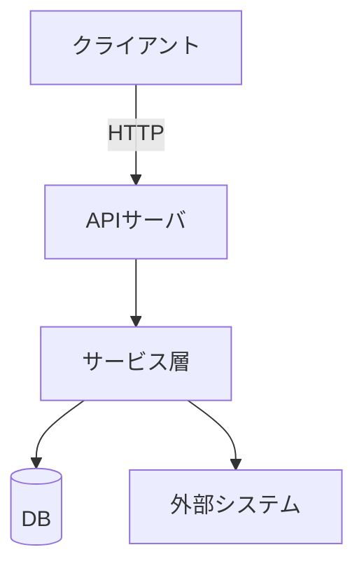

# CLAUDE.md  - Project Memory

## プロジェクト概要

> 2〜3 行でシステムの目的を記載。略語は初出時に定義する。
> 例: 〇〇装置を REST API 経由で一元管理するバックエンドサービス。〇〇（説明）の CRUD・ステータス取得・設定一括適用を提供し、複数拠点の装置を並列制御する。

## 機能一覧

> 動詞始まりの箇条書き。機能 ID は要件定義書（docs/requirements/）の FR-xxx と揃える。
> 例: `- 〇〇の登録・更新・削除・一覧取得（FR-001〜004）`

## アーキテクチャ

> Mermaid flowchart で主要コンポーネントとデータの流れを示す。15 要素以内に収める。

## 外部 I/F 仕様

> 詳細は docs/spec.md に分離し、ここではポインタと主要エンドポイントのみ記載。

| メソッド | パス | 概要 |
|---|---|---|
| POST | `/api/v1/resources` | リソース登録 |
| GET  | `/api/v1/resources/{id}` | リソース取得 |

## 技術スタック

> 言語バージョン・主要ライブラリ・ミドルウェアを記載。Claude がコードを書く際の選択基準になる。

| 区分 | 採用技術 |
|---|---|
| 言語 | Python X.XX |
| Web フレームワーク | （例: FastAPI） |
| バリデーション | （例: Pydantic） |
| 非同期 HTTP | （例: aiohttp） |
| ログ | structlog |
| DB / ストレージ | （例: PostgreSQL + SQLAlchemy） |
| テスト | pytest / pytest-asyncio |
| Lint / 型検査 | ruff / mypy --strict |
| 依存管理 | uv |
| コンテナ | Docker |

## システムスケール要件

> 数値で定量的に記載。「高速」「多い」などの曖昧な表現は禁止。

| 指標 | 目標値 |
|---|---|
| レスポンスタイム | p95 ≤ X 秒 |
| 同時接続数 | ≤ X セッション |

## Claudeの振る舞い

### 判断の方針

- **曖昧さの扱い**: 仕様が曖昧な場合、以下で判断する
  - 設計判断に影響する曖昧さ(I/F・データ構造・エラーハンドリング・ルーティング・冪等性): 必ず確認質問を返す
  - 命名・ログ文言・コメント表現の曖昧さ: 妥当な選択肢を1つ採用し、PR本文に「想定」として明記
  - 既存コードに前例がある曖昧さ: 前例に倣い、その旨を明記
- **不確実性の表明**: バージョン依存の挙動・ベンダー仕様の解釈・未確認のライブラリ仕様などは「未確認」「要検証」と明示し、可能な限り一次情報源(公式ドキュメント・装置のAPI仕様書)へのリンクを添える。憶測で断言しない
- **テストと実装の整合**: テストと実装が食い違う場合、docs/ の仕様に照らしてどちらが正かを判断する。仕様が不明確ならまず仕様を確定させる。テストを通すために実装を歪めない、実装を通すためにテストを甘くしない
- **ドキュメントとコードの不整合**: 発見したら修正前にどちらが正かの判断を求める。判断後、必要なら同じPRで両方を整合させる
- **過去の判断の尊重**: 既存のADR(`docs/design/decisions/`)に反する提案をする場合、先に該当ADRを更新するPRを出すか、本文でADRへの異議を明記する

### プロジェクト固有の禁止事項

> このプロジェクト特有の「やってはいけないこと」を記載する。
> 例: `- 装置への直接 SSH 接続は禁止（REST API 経由のみ許可）`
> 例: `- config/credentials.yaml を平文でログ出力しない`

### 変更の規模制御

- **大規模変更の計画提示**: 10ファイル超 or 100行超の新規実装は、実装前に計画を提示し承認を得る。
- **既存ファイルのリファクタ**: 依頼されない限り行わない。改善余地を発見した場合は PR本文への記載 or 別Issueとして提案する(自走で実施はしない)

### 不可逆操作の統制

副作用のある操作は実行前に確認を取る。対象例:

- **Git**: push、force push、merge、rebase、ブランチ削除、tag操作
- **GitHub**: Issue/PR作成、コメント投稿、ラベル変更
- **ファイルシステム**: ファイル/ディレクトリ削除、設定ファイル上書き

### 出力言語

- コード内コメント・docstring: 日本語
- コミットメッセージ: type/scope は英小文字、subject は日本語(例: `feat(launcher): ワーカー同時起動数の上限制御を追加`)
- Issue・PR・ドキュメント: 日本語
- 例外メッセージ・ログメッセージ: 日本語(structlogのキー名は英語)

## 開発フェーズ

作業開始時、Claudeは必ず docs/PHASE.html を読み、現在のフェーズに対応する成果物のみを扱う。

| フェーズ | 成果物 |
|---|---|
| 1. 要求整理 | docs/requirements/01_overview.html |
| 2. 要件定義 | docs/requirements/02_functional.html, 03_non_functional.html |
| 3. 基本設計 | docs/design/architecture.html, data_model.html, interfaces.html |
| 4. 詳細設計 | docs/design/配下 + 各モジュールのdocstring(*.html) + **処理フロー図** |
| 5. 実装 | TDD(処理フロー図に沿って実装) |

## 参照ドキュメント索引

タスクに応じて以下を参照する。Claudeは作業開始時に該当ファイルを読むこと。

| ファイル | 内容 | 読むタイミング |
|---|---|---|
| `.claude/dev.md` | 開発ガイドライン、テスト方針、GitHub運用 | コーディング・コミット・PR作成時 |
| `.claude/docs.md` | 仕様検討ルール、ドキュメント配置・記法、処理フロー設計、図示ガイドライン | ドキュメント作成・設計レビュー時 |
| `.claude/review.md` | 仕様レビュー観点 | 仕様・設計のレビュー時 |
| `docs/PHASE.html` | 現在の開発フェーズ | セッション開始時（必読） |
| `docs/spec.md` | 外部 I/F の詳細仕様 | 外部システム連携の実装・レビュー時 |
