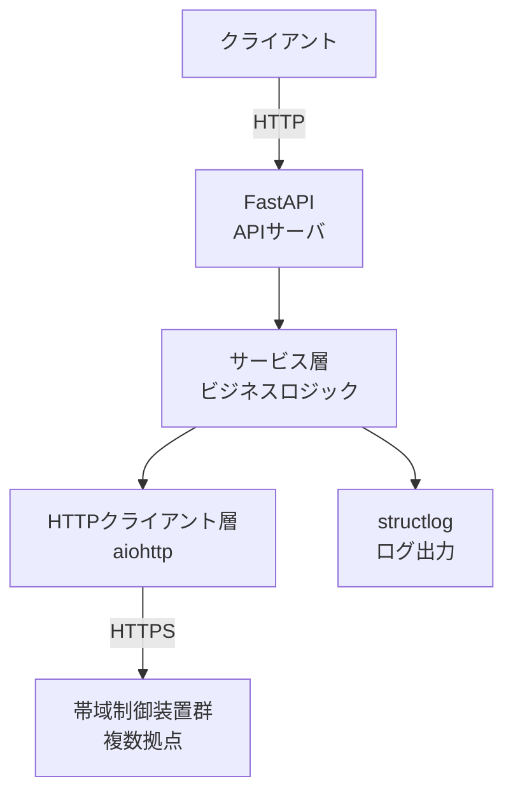

# 新プロジェクトへの適用手順

このテンプレートを新規 Python バックエンド業務システムプロジェクトに適用するための手順書。
プロジェクト開始時に一度だけ実施する。

## 前提条件

| ツール | バージョン | 用途 |
|---|---|---|
| Python | 3.11+ | 実行環境 |
| uv | 最新 | 依存管理・仮想環境 |
| Docker | 20.10+ | コンテナ実行（テスト・デプロイ） |
| GitHub CLI (`gh`) | 最新 | リポジトリ・PR 操作 |

## 手順

### 1. テンプレートをコピー

```bash
# 新プロジェクトのルートで実行
mkdir -p .claude
cp -r /path/to/03_project-memory/* .claude/
```

`.claude/` の構成:

```
.claude/
├── プロジェクトCLAUDE.md   # Claude のルールと知識ベース（必ず記入）
├── dev.md                  # 開発・Git 運用ガイドライン
├── docs.md                 # ドキュメント作成ルール
├── review.md               # 仕様レビュー観点
├── setup.md                # 本ファイル
└── checklist.md            # 開発チェックリスト
```

### 2. プロジェクト CLAUDE.md のプレースホルダーを埋める

`.claude/プロジェクトCLAUDE.md` を開き、以下の 5 箇所を記入する（詳細は[プレースホルダー記述ガイド](#プレースホルダー記述ガイド)参照）。

| 箇所 | 目安文字数 |
|---|---|
| システムの目的 | 2〜3 行 |
| 機能一覧 | 5〜15 項目 |
| アーキテクチャ | Mermaid 図 1 枚 |
| 装置仕様 | 参照先リンクまたは要約 |
| スケール要件 | 数値で定量的に |

### 3. ディレクトリ構造を作成

```bash
mkdir -p src/{プロジェクト名} tests/{unit,integration,e2e} docs/{design/decisions,design/flows,operations,requirements,scenario} config
```

推奨構造:

```
プロジェクトルート/
├── .claude/          # Claude 向けドキュメント（本テンプレート）
├── src/
│   └── {pkg}/        # src レイアウト
├── tests/
│   ├── unit/
│   ├── integration/
│   └── e2e/
├── tests/fixtures/   # 機器応答サンプル
├── docs/
│   ├── PHASE.html    # 現在の開発フェーズ（必須）
│   ├── design/
│   │   ├── decisions/  # ADR
│   │   └── flows/      # 処理フロー図
│   ├── operations/     # 運用手順書
│   ├── requirements/   # 要件定義
│   └── scenario/       # シナリオテスト手順
└── config/
```

### 4. 仮想環境・依存関係を初期化

```bash
uv init
uv add fastapi uvicorn pydantic structlog
uv add --dev pytest pytest-asyncio mypy ruff httpx
```

### 5. pyproject.toml を設定

`pyproject.toml` に以下を追加:

```toml
[tool.ruff]
line-length = 100
select = ["E", "F", "I", "N", "UP"]

[tool.mypy]
strict = true
python_version = "3.11"

[tool.pytest.ini_options]
testpaths = ["tests"]
asyncio_mode = "auto"
```

### 6. GitHub リポジトリを作成・保護設定

```bash
# リポジトリ作成（Private 推奨）
gh repo create {プロジェクト名} --private --source . --push

# Branch Protection（main / develop）
gh api repos/{owner}/{repo}/branches/main/protection \
  --method PUT \
  --field required_pull_request_reviews[dismiss_stale_reviews]=true \
  --field enforce_admins=true \
  --field allow_force_pushes=false \
  --field allow_deletions=false
```

### 7. 開発開始チェックリストを確認

`.claude/checklist.md` の「プロジェクト開始時」セクションを全て完了させる。

---

## プレースホルダー記述ガイド

### システムの目的（2〜3 行）

**書き方:** 「何を・どのように・なぜ」を 1 段落で。略語は初出時に定義。

```
例:
帯域制御装置（QoS 装置）を REST API 経由で一元管理するバックエンドサービス。
subport（サブポート: 帯域制御の最小単位）の CRUD・ステータス取得・設定一括適用を提供し、
複数拠点の装置を asyncio で並列制御する。
```

### 機能一覧

**書き方:** 動詞始まりの箇条書き。機能 ID（FR-001 など）は要件定義書と揃える。

```
例:
- subport の登録・更新・削除・一覧取得（FR-001〜004）
- 装置ステータスのポーリング取得（FR-005）
- 複数装置への設定一括適用（FR-006）
- 設定失敗時の Syslog 通知（FR-007）
- メンテナンスモードの切替（FR-008）
- 装置追加・撤去（FR-009）
```

### アーキテクチャ

**書き方:** Mermaid flowchart で主要コンポーネントとデータの流れを示す。15 要素以内に収める。

````
例:

````

### 装置仕様

**書き方:** 詳細は別ファイル（`docs/spec.md`）に分離し、ここではポインタのみ記載。

```
例:
詳細は docs/spec.md を参照。
主なエンドポイント:
  - POST /api/v1/subports        : subport 登録
  - GET  /api/v1/devices/{id}/status : ステータス取得
  - POST /api/v1/devices/bulk-apply  : 設定一括適用
```

### スケール要件

**書き方:** 数値で定量的に記載。曖昧な表現（「高速」「多い」）は禁止。

```
例:
- レスポンスタイム: p95 ≤ 2 秒（装置 1 台への操作）
- 同時接続数: ≤ 50 セッション
- 管理装置数: ≤ 200 台
- subport 数: 装置あたり ≤ 1,000
- 設定一括適用: 200 台同時送信で ≤ 30 秒
```
