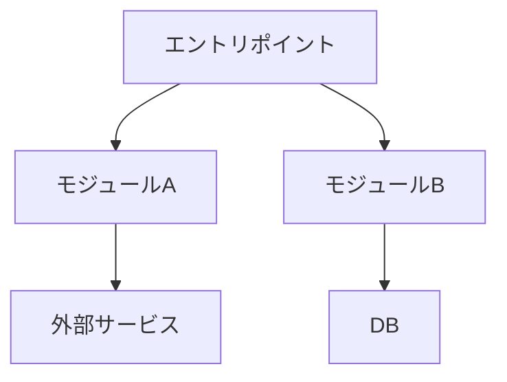
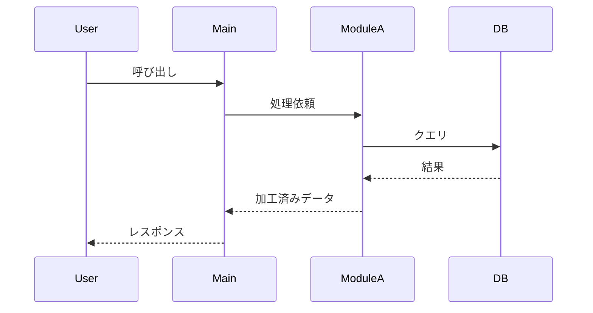
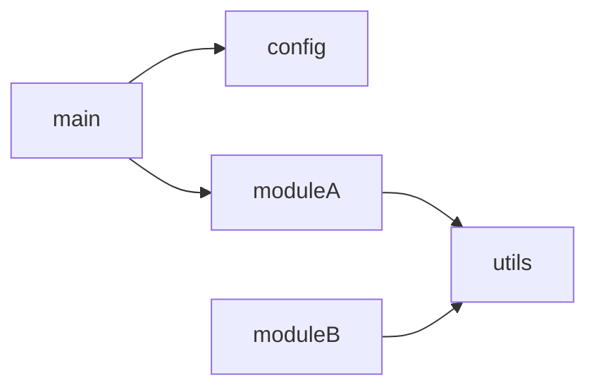
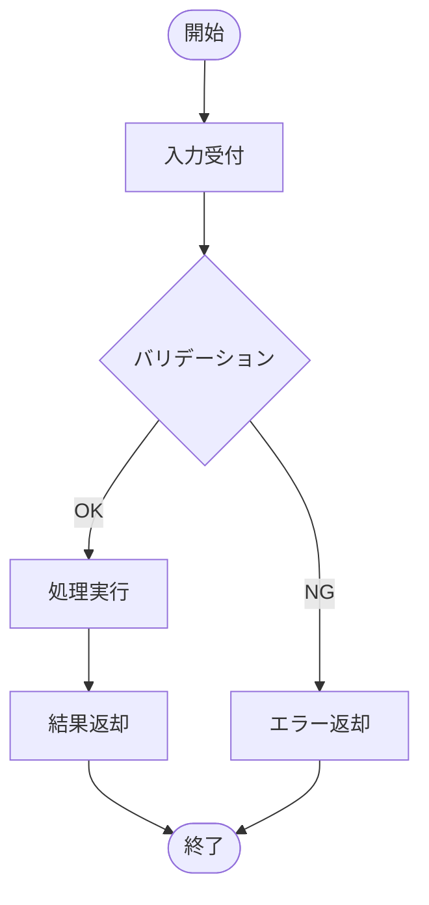
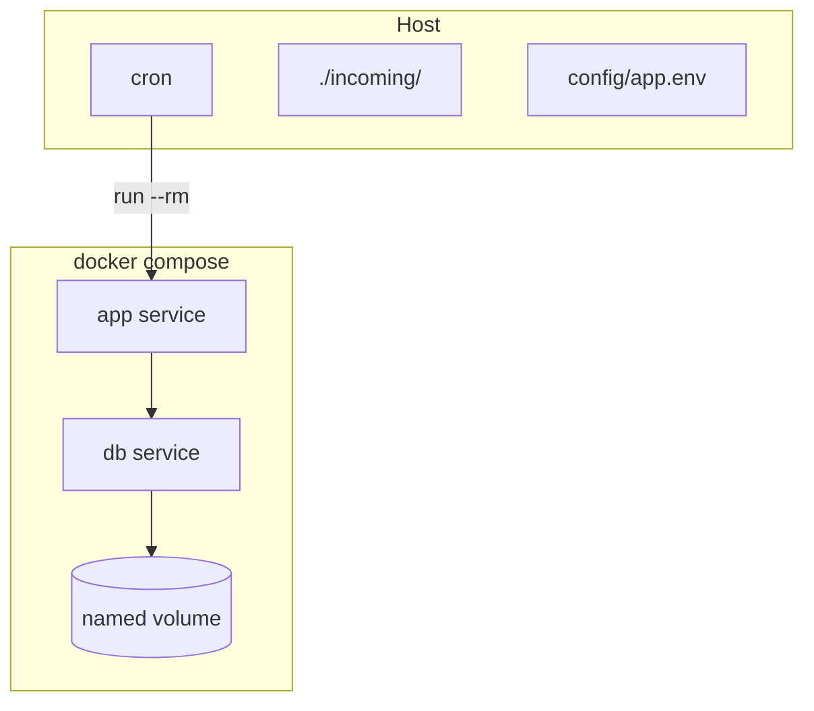

# Pythonコード → Markdown設計書 生成スキル

Pythonコードを解析し、プロジェクトの詳細設計書をMarkdown形式で生成する。
**実装の WHAT だけでなく、設計判断の WHY（なぜそうしたか）を残す**ことを最重要視する。

---

## 対応する設計書の構成

以下のセクションを必要に応じて含める。**実コードに対応物が存在しない章は省略する**（無理に空欄や "N/A" で埋めない）。

| § | セクション | 必須/条件 | 内容 |
|---|---|---|---|
| 改訂履歴 | ✅ | 作成・更新・追補・レビュー反映の履歴 |
| 1 | 概要・目的 | ✅ | システム概要、目的、背景、主な機能 |
| 2 | インプット/アウトプット仕様 | ✅ | 起動方法・引数・入力形式・出力形式。CSV/JSON 等は列レベル仕様を含める |
| 3 | 前提条件・実行環境 | ✅ | Python バージョン、OS、必要なシステムライブラリ等 |
| 4 | アーキテクチャ図 | ✅ | Mermaid の `graph` または `classDiagram` |
| 5 | 処理のメインフロー | ✅ | Mermaid の `sequenceDiagram` で主要な処理の流れ |
| 6 | クラス仕様 | ✅ | クラスの一覧・責務・主要メソッド（役割レベル）。クラスを持たないモジュールがあれば NOTE で明示 |
| 7 | APIリファレンス | ✅ | **モジュール単位**で公開関数・メソッド・内部関数・モジュール定数/変数を網羅 |
| 8 | 設定・環境変数一覧 | ✅ | 環境変数、設定ファイルのキー・デフォルト値・必須/任意 |
| 9 | DB/データ構造 | 条件付き | DB 操作・データクラス・スキーマがある場合。ORM 管理対象 / 管理外を分けて書く |
| 10 | 依存関係 | ✅ | 外部ライブラリ（バージョン付き）、内部モジュール依存図 |
| 11 | エラーハンドリング | ✅ | 方針・主要な例外クラス一覧・**実コードのログメッセージ**を含むログ出力方針 |
| 12 | フロー図 | 条件付き | 複雑な制御フローがある場合（Mermaid の `flowchart`） |
| 13 | テスト方針 | 条件付き | テストコードが存在する場合 |
| 14 | 既知の制限・実装メモ | 条件付き | 制限事項 / 設計判断 / 性能要件など、コードからは読み取りにくい運用上の前提 |
| 15 | **マイグレーション仕様** | **条件付き** | `migrations/` または Alembic 設定が存在する場合に追加 |
| 16 | **Docker / コンテナ構成** | **条件付き** | `Dockerfile` または `docker-compose.yml` が存在する場合に追加 |

> **判断のヒント**: 9・12・13・14・15・16 は「該当物がコードに無い場合は省略」が原則。「TODO もテストもないが章だけ作る」のはノイズになるので避ける。

---

## インプット

ユーザーは以下のいずれかの形式でコードを提供する。

| 形式 | 例 | 備考 |
|---|---|---|
| ファイルパス（1つ） | `/path/to/main.py` | 単一スクリプトの場合 |
| ファイルパス（複数） | `/path/to/moduleA.py`, `/path/to/moduleB.py` | 関連ファイルを列挙 |
| ディレクトリパス | `/path/to/project/` | プロジェクト全体を対象にする場合 |
| アップロードファイル | チャットに添付された `.py` ファイル | `/mnt/user-data/uploads/` に配置される |
| コードの直接貼り付け | チャットにコードをペースト | 一時ファイルとして `/home/claude/` に保存して処理する |

**不明な場合はユーザーに確認する:**
- 対象ファイル/ディレクトリのパスが指定されていない場合は、パスを教えてもらう
- 複数ファイルがある場合、エントリポイントを確認する
- `migrations/` や `docker-compose.yml` を §15・§16 の対象に含めるか確認する（プロジェクトルートに存在する場合）

---

## 手順

### Step 1: コードと周辺ファイルを収集する

ユーザーが提供した方法に応じて読み込む。

**ファイルが1つの場合:**
```bash
cat <ファイルパス>
```

**ディレクトリ全体の場合:**
```bash
find <ディレクトリ> -name "*.py" | sort
# 主要なファイルを特定してから cat で読む
```

**複数ファイルの場合:**
- まず `find` や `ls` でファイル一覧を把握する
- エントリポイント（`main.py`, `__main__.py`, `app.py` 等）を優先して読む
- `__init__.py` でモジュール構成を把握する

**周辺ファイル（**設計書品質を大きく左右するため必ず確認**）:**
```bash
# 依存・パッケージ管理
cat pyproject.toml 2>/dev/null
cat requirements.txt 2>/dev/null
cat uv.lock 2>/dev/null | head -50            # ロック有無の確認のみ
cat setup.py 2>/dev/null

# 設定・環境変数
cat config/app.env.example 2>/dev/null
cat .env.example 2>/dev/null
cat config.yaml 2>/dev/null; cat config.toml 2>/dev/null

# プロジェクト規約・スケール要件（設計判断の根拠）
cat CLAUDE.md 2>/dev/null
cat README.md 2>/dev/null

# §15 マイグレーション関連
ls migrations/versions/ 2>/dev/null
cat migrations/env.py 2>/dev/null
cat config/alembic.ini 2>/dev/null

# §16 コンテナ関連
cat docker-compose.yml 2>/dev/null
cat docker/Dockerfile 2>/dev/null
ls docker/ 2>/dev/null
```

### Step 2: コードを解析する

以下の観点でコードを読み込む。

1. **モジュール構成**: ファイル・クラス・関数のツリー構造
2. **エントリポイント**: `main()`, `if __name__ == "__main__"` ブロック、`pyproject.toml` の `[project.scripts]`
3. **クラス設計**: 継承関係、責務、主要メソッド。**クラスを持たないモジュールも明示する**
4. **関数シグネチャ**: 公開関数（`_` 始まりでない）と内部関数を分けて把握、引数・型ヒント・デフォルト値・戻り値の型・例外
5. **モジュール定数・モジュール変数**: 大文字定数、テストフックのモジュールローカル変数
6. **外部依存**: `import` 文 + `pyproject.toml`/`requirements.txt` からバージョンを照合
7. **設定・環境変数**: `os.environ`, `os.getenv`, `dotenv`, `configparser` 等の使用箇所と**デフォルト値**
8. **DB操作**: SQLAlchemy / asyncpg / psycopg2 / sqlite3 等の使用箇所、ORM モデル定義
9. **例外処理**: `try/except` ブロック、カスタム例外クラス、再送出/握り潰しの方針
10. **ログ出力**: `logging` モジュールの設定、実際に出力されるメッセージ文字列
11. **テストコード**: `test_*.py` から仕様・境界条件を読み取る（設計書の参考にする）
12. **マイグレーション**: 各リビジョンの `upgrade()` を読み、SQL ハイライトと設計判断を抽出
13. **コンテナ**: サービス構成、profiles、healthcheck、bind mount、network

### Step 3: 設計判断（why）を抽出する

コードの WHAT は読めば分かるので、設計書の価値は **「なぜそうしたか」** を残せるかにある。以下のシグナルを拾う。

- コメント内の「〜のため」「〜する目的で」「〜回避」
- 過去の migration で `DROP → CREATE` している箇所（カラム追加できない制約の表れ）
- 通常と異なるパターン（例: `ON CONFLICT` ではなく `DELETE → INSERT`、`@functools.cache` での遅延初期化）
- スレッドプール委譲（`asyncio.to_thread`）— なぜ必要か
- PK や UNIQUE 制約の有無の選択
- バージョン制約（`>=2.0` など）の意味
- `CLAUDE.md` などプロジェクト規約に書かれた制約・スケール要件

抽出した why は、対応する章に「**設計判断**」「**設計上のポイント**」「**重要な設計判断**」として箇条書きまたは表で残す。

### Step 4: Markdown設計書を生成する

以下のテンプレートに沿って設計書を生成する。**実コードに対応物がない章は丸ごと省略する**（章番号は詰めて連番にする）。

---

## 設計書テンプレート

````markdown
# <システム名> 詳細設計書

**対象コード**: `<ファイル名 or ディレクトリ名>`
**言語**: Python <バージョン（判明する場合）>
**プロジェクト**: <プロジェクト名（CLAUDE.md/README.md から拾う）>

---

## 改訂履歴

| バージョン | 日付 | 変更内容 | 作成者 |
|---|---|---|---|
| 1.0 | YYYY-MM-DD | 初版作成（`<対象>` を対象に詳細設計書を生成） | Claude (`/python-to-design-doc`) |

> 追補・レビュー反映があった場合は v1.1, v1.2, … と行を追加し、**何を変えたか**を 1 行で明記する。

---

## 1. 概要・目的

<システムの概要を 2〜4 文で記述。何を解決するシステムか、誰が使うか、主な機能は何かを含める。
プロジェクトの規約ファイル（CLAUDE.md など）に「目的」が書かれている場合はそれを尊重しつつ、コードの実装スコープに即して書く>

### 1.1 主な機能

- 機能1
- 機能2

---

## 2. インプット/アウトプット仕様

### 2.1 インプット

| 項目 | 形式 | 必須 | 説明 |
|---|---|---|---|
| `input_param` | 型（例: str） | ✅ | <説明> |
| `option_param` | 型（例: int） | - | <説明>（デフォルト: 値） |

#### 2.1.1 <入力データ A> のスキーマ（CSV/JSON など列レベル仕様がある場合）

```
列1,列2,列3
```

- `列1`: 型・書式・例
- `列2`: 型・書式・例

### 2.2 アウトプット

| 項目 | 形式 | 説明 |
|---|---|---|
| 正常時 | 型（例: dict / DB 行） | <説明> |
| 異常時 | 例外 / エラーコード / 隔離ファイル | <説明> |

---

## 3. 前提条件・実行環境

| 項目 | 要件 |
|---|---|
| Python バージョン | 3.x 以上（`pyproject.toml` の `requires-python` から） |
| OS | Linux / macOS / Windows（POSIX 専用 API があれば明記） |
| システムライブラリ | libssl, libffi 等（必要な場合のみ） |
| 外部サービス | DB / メッセージキュー / 認証サービス等 |
| 事前手順 | マイグレーション適用、環境変数設定、ディレクトリ作成等 |

---

## 4. アーキテクチャ図



<図の補足説明: データフローの方向、責務の分担>

---

## 5. 処理のメインフロー



**設計上のポイント:**
- <なぜこのフロー構造なのか、トランザクション境界がどこにあるのか、並行性の扱いなど>
- <非同期処理・スレッドプール委譲の理由>

---

## 6. クラス仕様

### 6.1 クラス一覧

| クラス名 | 所属モジュール | 役割 | 継承 |
|---|---|---|---|
| `ClassName` | `pkg.module` | 〇〇を管理する | `BaseClass` |

> NOTE: クラスを持たない関数中心のモジュール（例: `pkg.utils`, `pkg.cli`）がある場合はここで明示する。誤って「クラスの記載漏れ」と読まれないようにするため。

### 6.2 各クラスの詳細

#### `ClassName`

**概要**: <クラスの責務を 1〜2 文で。設計判断があれば併記>

**カラム / 属性 / 主要メソッド:**

| 項目 | 型/シグネチャ | 役割 |
|---|---|---|
| `attr` | `int` | <説明> |
| `method_name(self, ...)` | `(...) -> RetType` | <説明> |

---

## 7. APIリファレンス

> 公開関数・メソッドの引数・戻り値・例外の網羅的なリファレンス。**モジュール単位**で章立てる。
> §6 は役割レベルの説明、こちらは実装レベルの仕様。

### 7.1 `<pkg.module1>`

#### `function_name(arg1: 型, arg2: 型 = デフォルト) -> 戻り値型`

| 項目 | 内容 |
|---|---|
| **概要** | <何をする関数か。設計判断があれば併記> |
| **引数** `arg1` | (型) 説明 |
| **引数** `arg2` | (型, optional, default=値) 説明 |
| **戻り値** | 型: 説明 |
| **例外** | `ExceptionClass`: 発生条件 |

#### 内部関数

| 関数 | シグネチャ | 役割 |
|---|---|---|
| `_helper(...)` | `(...) -> ...` | <内部用途。なぜモジュール内に閉じているか> |

#### モジュール定数

| 定数 | 値 | 説明 |
|---|---|---|
| `INTERVAL_SECONDS` | `300` | 5 分 = 300 秒。〇〇換算の分母 |

#### モジュール変数

| 変数 | 値 / 由来 | 説明 |
|---|---|---|
| `_WATCH_DIR` | `Path | None` | テスト上書き用。本番では `None` |

### 7.2 `<pkg.module2>`

…（同じパターンを各モジュールごとに繰り返す）

---

## 8. 設定・環境変数一覧

`<config/app.env など>` に記述し、`<load_dotenv() などの呼び出し箇所>` でロードされる。

| 変数名 / キー | デフォルト値 | 必須 | 説明 |
|---|---|---|---|
| `DATABASE_URL` | なし | ✅ | DB 接続文字列 |
| `LOG_LEVEL` | `INFO` | - | ログレベル |
| `RETRY_COUNT` | `3` | - | 外部 API 呼び出しのリトライ回数 |

> NOTE: コード内で `os.environ[...]` （必須）と `os.getenv(..., default)` （任意）を区別して扱っている場合は、その違いを明記する。

---

## 9. DB/データ構造

※ DB 操作やデータクラスが存在する場合のみ記載。

### 9.1 ORM 管理対象テーブル

| テーブル | クラス | パーティションキー | PK 構成 | 保持期間 |
|---|---|---|---|---|
| `flow_stats` | `FlowStat` | `time_stamp` | `(time_stamp, flow_id)` | 31 日 |

### 9.2 ORM 管理外（マイグレーションでのみ管理）

| オブジェクト | 種別 | 説明 |
|---|---|---|
| `flow_stats_hourly` | Continuous Aggregate | 〜 |
| `<table>_<col>_idx` | INDEX | 自動生成インデックス（autogenerate 比較から除外） |

### 9.3 派生カラムの計算式

| カラム | 計算 | 適用先 |
|---|---|---|
| `mbps_in` | `volume_in * 8 / 300 / 1_000_000` | `flow_stats` / `subport_stats` |

### 9.4 ID フォーマット

```
<ID 形式の例と意味>
```

### 9.5 主要なデータクラス / TypedDict

```python
@dataclass
class ExampleData:
    field1: str
    field2: int
```

---

## 10. 依存関係

### 10.1 外部ライブラリ

| ライブラリ | バージョン | 用途 |
|---|---|---|
| `requests` | `>=2.28` | HTTP 通信 |
| `sqlalchemy[asyncio]` | `>=2.0` | ORM |

### 10.2 内部モジュール依存関係



> 依存の方向（片方向か循環があるか）、エントリポイントが束ねる構造になっているかを文章で補足する。

---

## 11. エラーハンドリング

### 11.1 基本方針

- <例: 取り込み失敗で全体を止めない・失敗ファイルは隔離・アラートは集約 など>
- <アラート発火条件を ① ② で具体的に書く>
- <重複通知抑制・冪等性の確保方法>

### 11.2 主要な例外クラス

| 例外クラス | 基底クラス | 発生箇所 / 条件 |
|---|---|---|
| `ValueError` | `Exception` | <発生条件: ファイル名抽出失敗、書式不正、範囲外 等> |
| `CustomError` | `Exception` | <発生条件> |

### 11.3 ログ出力方針

`<logging.basicConfig の設定値>` を `<どこで>` 設定。Syslog 等の別経路がある場合はここで併記。

| レベル | 使用場面（**実コードのログメッセージそのまま記載**） |
|---|---|
| `INFO` | `ingest started`, `loaded N rows from <file>`, `skipped N unstable file(s)` |
| `ERROR` | `ingest failed for <file>`, `failed to read <file>` |
| Syslog `LOG_ERR` | `ingest summary: failed=N backlog=M (threshold=K)` |

> 汎用的な「正常系の主要処理」ではなく、コード内の `logger.info(...)` の文字列をそのまま転記する。grep の手がかりになり、運用上の価値が高い。

---

## 12. フロー図 ── `<対象関数名>` の制御フロー

複雑な制御フロー（分岐の多い関数、トランザクション境界を含む処理）がある場合のみ記載。



**設計判断 / 補足:**
- <冪等性が成立する理由、トランザクション境界の意味、空入力の扱いなど>

---

## 13. テスト方針

`tests/` 配下に単体・結合テストを配置している場合のみ。

| 種別 | 対象ファイル | 役割 |
|---|---|---|
| 単体（パーサ） | `tests/test_parser.py` | CSV → DataFrame、バリデーション、派生カラム |
| 結合（DB） | `tests/integration/test_db_*.py` | 実 DB に対する E2E |

実行コマンド:

```bash
pytest                              # 全件
pytest tests/test_parser.py -v      # 単体
pytest -m integration               # 結合のみ
```

---

## 14. 既知の制限・実装メモ

| 項目 | 内容 | 備考 |
|---|---|---|
| 制限 | <例: 同一ファイル内重複は DB 検出されず> | <経緯・代替策> |
| 設計判断 | <例: SysLogHandler を遅延生成> | <なぜ必要か> |
| 性能要件 | <例: 必要スループット 20,013 rows/sec> | <根拠の参照先> |

---

## 15. マイグレーション仕様（`migrations/`）

> **このセクションは `migrations/` または Alembic 設定が存在する場合に追加する**。スキーマ・拡張機能（hypertable / CA 等）・retention/compression ポリシーが Alembic マイグレーションで管理されている場合、コードと並んで設計の中核となる。

### 15.1 Alembic ランナー（`migrations/env.py`）

| 項目 | 内容 |
|---|---|
| メタデータ | `<src.db.models.Base.metadata など>` |
| ドリフト除外フィルタ | `include_object` 等を使っていれば、何を除外するか明記 |
| トランザクションモード | デフォルト / `AUTOCOMMIT`（理由を併記） |
| ドライバ | 同期 / 非同期、async engine の場合は `run_sync` の有無 |
| 環境変数読み込み | どのタイミングでロードされるか |

### 15.2 リビジョン一覧

| Rev | タイトル | 主要変更点 |
|---|---|---|
| `0001` | <タイトル> | <一文要約> |
| `0002` | <タイトル> | <一文要約> |

### 15.3 各リビジョンの詳細

#### `0001` <タイトル>

- 主要な DDL（`CREATE TABLE` / `create_hypertable` / `add_retention_policy` 等）
- **設計判断**: なぜこの構造を選んだか
- 例: PK の選び方、segmentby の cardinality 議論

```sql
-- 重要な SQL のハイライト（全文ではなく要点）
CREATE MATERIALIZED VIEW ... WITH (timescaledb.continuous) AS ...
```

…（各リビジョンを同形式で繰り返す）

### 15.4 リビジョン依存関係


### 15.5 retention/compression/CA refresh ポリシー早見表（最終状態）

該当する拡張機能（TimescaleDB / pgvector など）を使っている場合のみ。

| オブジェクト | retention | compression | segmentby | orderby | CA refresh |
|---|---|---|---|---|---|
| `flow_stats` | 31 日 | 7 日 | `subport` | `time_stamp DESC` | — |

### 15.6 ORM／DB 不整合（autogenerate ドリフト）の扱い

`src/db/models.py` には DB 状態が ORM 上に表現されていないものがある場合、それぞれをどう扱うかを記載。

- **`include_object` がフィルタする対象**: <具体的なオブジェクト名と条件>
- **フィルタ対象外で、テスト側で許容している差分**: <DB レベル PK 削除、圧縮設定、retention/CA など SQLAlchemy メタデータに載らない構成>
- **整合検証**: `tests/integration/test_alembic_drift.py` 等で担保

---

## 16. Docker / コンテナ構成

> **このセクションは `Dockerfile` または `docker-compose.yml` が存在する場合に追加する**。

### 16.1 構成概要



### 16.2 `docker-compose.yml` 仕様

#### `<サービス名>` サービス

| 項目 | 値 | 説明 |
|---|---|---|
| `image` / `build` | <image または build context> | <なぜそれを選んだか> |
| `environment` / `env_file` | <設定> | <注入される環境変数> |
| `ports` | <マッピング> | <用途> |
| `volumes` | <マウント> | <名前付き volume か bind か> |
| `healthcheck` | <設定> | <他サービスの depends_on で待つか> |
| `profiles` | <profile 名> | <`up` で誤起動しない理由などの設計判断> |
| `depends_on` | <条件> | <`service_healthy` 待ちか> |
| `logging` | <ドライバとローテーション> | <max-size, max-file> |

…（各サービスを同形式で繰り返す）

#### named volume

| 項目 | 値 | 説明 |
|---|---|---|
| `db_data` | `name: <fixed_name>` | <volume を named にした設計判断> |

### 16.3 `Dockerfile` 仕様

```dockerfile
FROM python:3.x-slim
WORKDIR /app
RUN pip install uv
COPY pyproject.toml .
RUN uv sync --no-dev
COPY src/ src/
CMD ["uv", "run", "python", "-m", "<entrypoint>"]
```

| 項目 | 内容 | 設計判断 |
|---|---|---|
| ベースイメージ | `python:3.x-slim` | `requires-python` と整合、サイズ抑制 |
| パッケージ管理 | `uv` / `pip` | <選択理由> |
| 依存インストール | `--no-dev` 等 | 本番イメージに dev 依存を含めない |
| ソースコピー | <含める範囲> | <tests/ や migrations/ を含めない理由> |
| `CMD` | <実行コマンド> | <ワンショットか常駐か> |

> NOTE: `uv.lock` 等のロックファイルが COPY されていない場合は再現性の改善余地として明記する。

### 16.4 起動・運用コマンド

```bash
# DB のみ起動（常駐）
docker compose up -d db

# 取り込みワーカーを 1 回だけ実行
docker compose run --rm app
```

#### cron 設定例（5 分間隔）

```cron
*/5 * * * * cd /opt/<project> && /usr/bin/docker compose run --rm app >> /var/log/<project>.log 2>&1
```

### 16.5 ホスト ↔ コンテナのパスマッピング

| ホスト側 | コンテナ側 | 役割 |
|---|---|---|
| `${INGEST_WATCH_DIR_HOST:-./incoming}` | `/var/spool/<project>` | 着地ディレクトリ |
| `db_data`（named volume） | `/var/lib/postgresql/data` | DB データ |

> **重要**: bind mount の同一 volume 性が必要な場合（`Path.rename` の atomic 性など）は明記する。

### 16.6 ネットワーク

- compose のデフォルト bridge ネットワーク
- サービス間は名前解決（例: `db:5432`）
- ホストからの接続は `localhost:<port>`

### 16.7 ログ・観測

| サービス | 出力先 | ローテーション |
|---|---|---|
| `db` | docker のデフォルトログドライバ | docker daemon の設定 |
| `app` | stdout（worker の `logging.basicConfig`） | `max-size=10m`, `max-file=5` |
| Syslog | `SYSLOG_HOST:SYSLOG_PORT`（UDP） | コンテナ外で管理 |

> **本番運用上の注意**: コンテナ内 `localhost` はホストではなくコンテナ自身。ホスト側で受信する場合は IP/FQDN または `network_mode: host` を使う。

### 16.8 既知の制限・改善余地

| 項目 | 内容 |
|---|---|
| 制限 | <例: `migrations/` がイメージに含まれない> |
| 制限 | <例: `uv.lock` を COPY しないため再現性が緩い> |
| 設計判断 | <例: `profiles: ["worker"]` で `up` 誤起動を防止> |

---

> 本書は `/python-to-design-doc` スキルにより `<対象パス>` 配下のソースコードと `<参照した設定/規約ファイルの一覧>`（例: `pyproject.toml`, `config/app.env.example`, `CLAUDE.md`, `migrations/`, `docker-compose.yml`, `docker/Dockerfile`）を参照して自動生成された。<関連ドキュメントへのリンクがあれば併記>。
````

---

## 品質チェックリスト

設計書を生成した後、以下を確認する。

### 構造
- [ ] Mermaid 記法の構文エラーがない（`sequenceDiagram` の `participant` 宣言、`graph` のノード名、`flowchart` のラベル等）
- [ ] セクション番号が 1 から連番になっている（省略した章があれば後続を詰める）
- [ ] 該当物がないセクション（例: テストコード無しなら §13）は省略している

### API リファレンス（§7）
- [ ] **モジュール単位**に章立てている（`7.1 pkg.moduleA`, `7.2 pkg.moduleB`, …）
- [ ] 各モジュールに「公開関数」「内部関数」「モジュール定数」「モジュール変数」のサブテーブルが（該当物がある範囲で）含まれている
- [ ] クラス仕様（§6）と APIリファレンス（§7）が重複せず役割分担されている（§6 は責務、§7 は呼び出し仕様）

### コード対応の正確性
- [ ] 全クラス・公開関数が APIリファレンス（§7）に記載されている
- [ ] 例外クラスが網羅されている（カスタム例外含む）
- [ ] 依存関係のバージョンが `requirements.txt` / `pyproject.toml` と一致している
- [ ] 設定・環境変数がコード中の `os.getenv` / `os.environ` と一致している
- [ ] **ログ出力方針（§11.3）に実コードのログメッセージそのまま**を載せている

### 条件付きセクション
- [ ] §6 でクラスを持たないモジュールがあれば NOTE で明示している
- [ ] §9 DB/データ構造は DB 操作がない場合は省略している
- [ ] §12 フロー図はメインフロー（シーケンス図）と重複していない（複雑な制御フローのみ）
- [ ] §13 テスト方針・§14 TODO は該当コードがない場合は省略している
- [ ] **§15 マイグレーション仕様**は `migrations/` または Alembic 設定がある場合に含めている
- [ ] **§16 Docker / コンテナ構成**は `Dockerfile` / `docker-compose.yml` がある場合に含めている

### 設計判断（why）
- [ ] 各章で「設計判断」「設計上のポイント」「重要な設計判断」のコールアウトがあり、なぜそうしたかが残っている
- [ ] 通常と異なるパターン（`DELETE → INSERT`、`@functools.cache` 遅延生成、`asyncio.to_thread` 委譲など）には理由が併記されている

### その他
- [ ] 前提条件の Python バージョンが明記されている
- [ ] 末尾にプロベナンス行（参照したファイル一覧）がある

---

## 出力

- ファイル名: `design.md`
- 出力先: `<プロジェクトルート>/docs/`（プロジェクトのルートディレクトリ直下の `docs/` フォルダ。存在しない場合は `mkdir -p` で作成する）

---

## 注意事項

- コードに docstring がない場合でも、コードの内容から推測して記述する。**ただし推測である旨が分かるように書きすぎない**（読み手は仕様として読むため、過度な「〜と思われる」は避け、自信のない箇所は確認すべき項目として §14 に挙げる）
- 型ヒントがない場合は `Any` と記述し、推測できる場合は補足する
- テストコード（`test_*.py`）は設計書の対象外だが、テストから仕様・境界条件を読み取る参考にする
- クラス仕様（§6）は「何をするクラスか」の役割説明、APIリファレンス（§7）は「どう呼ぶか」の実装仕様として明確に使い分ける
- マイグレーションは「どう書かれているか」より「**なぜそうしたか**」（PK の選択、CA の refresh 間隔の選定理由、圧縮 segmentby の cardinality 議論など）を残すことを優先する
- Docker は「コンテナの構造」だけでなく「**運用の前提**」（cron 起動・ワンショット実行・ホスト/コンテナ間の volume 共有制約など）を明記する
- **WHAT より WHY を残す**: 実装は読めば分かる。設計書の価値は「なぜそうしたか」を将来の読み手に伝えること
